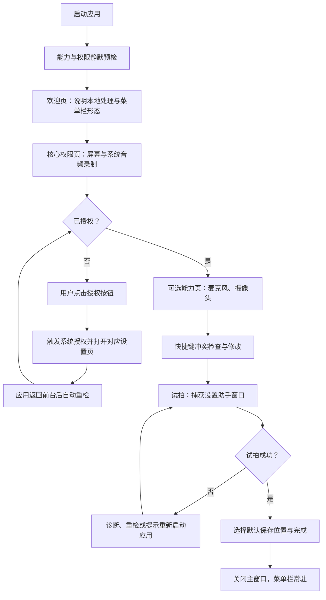
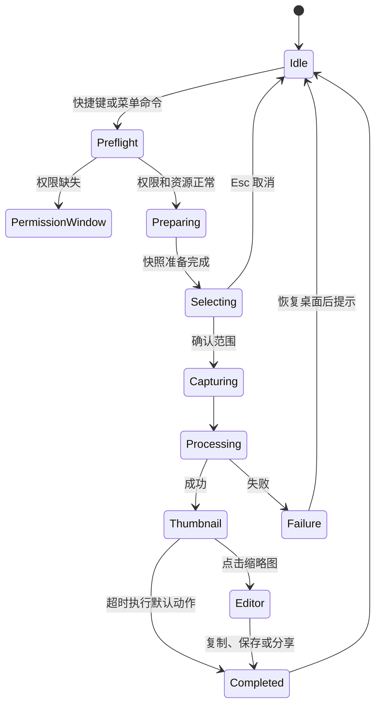
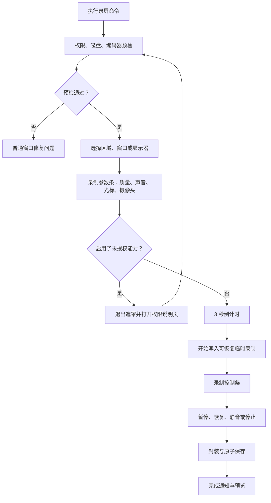

# 原生 macOS 截图与录屏软件设计方案

版本：产品方案 v1.0  
品牌：有度 · 拾光（Modus · Imago；产品短名：M · Imago）  
目标平台：macOS 14+；macOS 15+ 提供增强录音能力  
产品形态：菜单栏常驻应用 + 必要时出现的窗口、选择遮罩和编辑器

> Logo 尚在制作。本方案先以文字品牌建立稳定的识别层级；所有图形 Logo 位均为可替换资产位，不以临时图标作为最终品牌标识。

## 1. 产品目标

做一款启动快、权限透明、不会在截图临界时打断用户、默认本地处理的原生 macOS 截图与录屏工具。

产品的核心体验指标：

- 用户按下快捷键后，能直接进入选择状态，不出现临时权限弹窗。
- 截图从快捷键到完成选择应尽量控制在一次拖拽内。
- 录屏开始前，用户能明确看到范围、画质、声音来源和预计文件大小。
- 截图、录屏中发生异常时，应用必须先恢复桌面可操作状态，再展示错误。
- 原始截图和已录制片段优先落到本地临时存储，避免崩溃或导出失败造成内容丢失。

## 2. 产品原则

### 2.1 权限先于沉浸界面

任何可能触发系统授权的调用，都必须发生在普通应用窗口或菜单栏面板中。禁止在以下状态请求系统权限：

- 全屏截图遮罩已经显示；
- 鼠标和键盘正在被截图选择器接管；
- 录屏倒计时已经开始；
- 编辑器正处于模态导出流程。

统一规则：`收到命令 → 权限预检 → 能力预检 → 再进入遮罩或录制状态`。

### 2.2 最小权限

基础截图和录屏的核心权限是“屏幕与系统音频录制”。不默认索要辅助功能或输入监控权限。

- 屏幕与系统音频录制：首次设置时主动完成。
- 麦克风：用户选择使用麦克风时申请，可在首次设置中提前完成。
- 摄像头：用户启用摄像头悬浮画面时申请，可在首次设置中提前完成。
- 辅助功能：v1 不需要。未来只有滚动截图、读取控件语义等明确功能需要时，单独解释后申请。
- 输入监控：v1 不需要。全局快捷键使用不依赖输入监控的注册方式。
- 通知：首次完成录屏后，再用上下文方式询问，不放在首次启动权限清单中。
- 文件夹访问：通过系统文件选择器获得目标目录授权，不扫描用户磁盘。

### 2.3 永远可退出

所有全屏或浮层状态都必须响应 `Esc`。异常时先销毁遮罩、恢复鼠标形态和键盘焦点，再显示错误窗口。

### 2.4 本地优先与明确反馈

默认不上传。所有耗时操作显示进度；所有内容先写临时文件，再原子移动到最终位置。

## 3. 产品信息架构

应用由六个主要界面构成：

| 界面 | 作用 | 出现方式 |
|---|---|---|
| 首次设置助手 | 权限解释、授权、快捷键检查、试拍 | 第一次启动或手动重新打开 |
| 菜单栏面板 | 日常入口、最近记录、权限/状态提示 | 点击菜单栏图标 |
| 截图/录屏选择器 | 选择区域、窗口、显示器和快速参数 | 快捷键或菜单命令 |
| 截图编辑器 | 标注、裁剪、打码、复制和导出 | 点击缩略图或设置为自动打开 |
| 录制控制条 | 暂停、恢复、静音、停止和计时 | 录屏开始后 |
| 设置窗口 | 常规、截图、录屏、快捷键、权限、存储 | 菜单栏面板进入 |

建议菜单栏面板结构：

1. 区域截图
2. 窗口截图
3. 全屏截图
4. 录制区域
5. 录制窗口或显示器
6. 最近项目
7. 设置、首次设置助手、退出

当权限或存储异常时，在顶部显示一条可操作状态卡，不让错误混入普通命令列表。

### 3.1 品牌、视觉与交互基调

产品对外名称统一使用“有度 · 拾光”，英文场景使用“Modus · Imago”，空间受限时使用“M · Imago”。品牌文字不承担命令含义，菜单项、按钮和系统权限说明仍使用明确的功能动词。

| 场景 | 品牌呈现 | Logo 完成前的处理 |
|---|---|---|
| 首次设置助手、设置窗口 | “有度 · 拾光”主标题，下方可显示“Modus · Imago” | 左侧预留 20–24 pt 方形 Logo 位；缺少资产时只显示文字，不使用临时图案 |
| 菜单栏面板 | “M · Imago”标题；副标题为当前状态 | 菜单栏使用中性 SF Symbol 作为功能图标，不将其宣传为 Logo |
| 截图编辑器、录制控制条 | 不重复放置完整品牌，仅在窗口标题或关于页保留 | 维持工具优先，避免干扰捕获和编辑 |
| 导出文件、共享元数据 | 默认文件名使用 `M-Imago_日期_时间` | 不向截图或视频内容强制添加水印 |

品牌文字需使用可本地化的字符串资源；“有度 · 拾光 / Modus · Imago / M · Imago”作为同一品牌的三种固定显示形式，禁止在单个界面混用为不同产品名。Logo 交付后，只替换统一的 `BrandMark` 资产与上述预留位，不能改变窗口尺寸、工具栏布局或命令名称。

界面统一使用本地 FormaUI 组件库：`/Users/luohao/Desktop/mineProject/mac-app/FormaUI/components/FormaUI`。仍应遵循 macOS 用户已经熟悉的行为：

- 普通设置使用标准窗口、侧边栏和工具栏层级。
- 菜单栏面板保持紧凑，不把完整设置塞进弹出面板。
- 捕获遮罩只突出当前可操作区域，其余内容降低亮度但仍可辨认。
- 红色只用于正在录制、破坏性操作和严重错误；权限未设置使用中性提醒色。
- 系统授权按钮使用明确动词，例如“允许屏幕捕获”，不写模糊的“继续”。
- 所有图标同时提供工具提示和可访问性标签，不能只依靠图标表达。
- 支持浅色、深色、提高对比度、减少透明度和完整键盘操作。

### 3.2 FormaUI 组件契约

FormaUI 负责普通窗口、菜单栏面板和表单的视觉与交互一致性；ScreenCaptureKit 选择遮罩、精确窗口层级及录制控制条仍由 AppKit/业务模块管理。业务模块只提供状态和值，组件不直接承担截图、录制、编码或文件写入。

| 产品语义 | FormaUI 映射 | 必需状态 |
|---|---|
| 权限状态卡 | `FormaPermissionRow`、`FormaPermissionChecklist`、`FormaPermissionGate`、`FormaPermissionCenter` | 未请求、请求中、允许、拒绝、需重启、不可用 |
| 菜单栏面板与命令项 | `FormaMenuBarItemController`、`FormaMenuBarPanel`、`FormaMenuBarPanelAction` | 默认、悬停、按下、禁用、快捷键冲突 |
| 主操作与危险操作 | `FormaButton` | 主操作、次操作、加载、禁用、破坏性操作 |
| 模式、范围与质量选择 | `FormaCompactRail`、`FormaDiscreteRail` | 已选、未选、禁用、快捷键冲突 |
| 来源开关与设备选择 | `FormaSwitch`、`FormaDropdown`、`FormaFormRow` | 关闭、开启、未授权、设备断开 |
| 音频电平与导出进度 | `FormaProgressBar`、`FormaInlineMessage` | 正常、静音、削波、无输入、处理中 |
| 普通工具条与属性检查器 | `FormaCard`、`FormaFormRow`、`FormaPopoverButton`、`.formaTooltip` | 无选择、单对象、多对象、混合值 |
| 浮动缩略图、恢复项目与状态提示 | `FormaCard`、`FormaToast`、`FormaAlertBanner`、`FormaStatusIndicator` | 处理中、完成、失败、堆叠、可恢复 |

`FormaGlobalShortcutCenter` 用于全局快捷键注册与冲突反馈，`FormaApplicationBehaviorCenter` 用于登录时启动与 Dock/菜单栏显示偏好。所有 FormaUI 根视图由 `FormaUIRoot` 包裹，默认关闭机械化装饰音效；如未来提供音效偏好，默认应为静音或轻量 classic，不得录入屏幕录制结果。

**平台兼容性决策：**当前 FormaUI 的 Swift Package 声明最低为 macOS 26，而本产品目标为 macOS 14+。正式接入前必须二选一：将 M · Imago 的最低系统版本提升至 macOS 26，或在本地 FormaUI 中维护 macOS 14+ 可编译分支/兼容层。未完成该决策前，不得把 FormaUI 作为 macOS 14–25 构建的硬依赖。

业务模块只向这些组件提供状态和值，组件不直接调用 ScreenCaptureKit、权限 API 或文件系统。

## 4. 首次启动动线

### 4.1 欢迎页

只传达三件事：

- 应用常驻菜单栏，主要通过快捷键使用；
- 截图与录屏默认只保存在本机；
- 接下来会在实际使用前完成必要权限设置。

### 4.2 核心权限页

权限卡应包含：状态、用途、是否必需、授权按钮、重新检测按钮。

屏幕录制权限文案重点说明：用于读取用户选择的屏幕、窗口或区域；应用自身的控制条和浮层会从结果中排除。

授权交互：

1. 先显示应用内解释。
2. 只有用户点击“允许屏幕捕获”后，才调用系统授权 API。
3. 系统设置打开后，应用保留普通窗口，不进入截图遮罩。
4. 应用重新激活时自动重检；同时保留“我已授权，重新检测”。
5. 若系统已显示允许但 API 仍不可用，展示“重新启动应用并继续”，重启后回到当前步骤。

用户可以暂时退出设置助手，但菜单栏所有捕获命令显示锁定状态；点击时回到权限页，而不是直接触发系统弹窗。

### 4.3 可选能力页

提供两个明确开关：

- “录屏时使用麦克风”
- “录屏时显示摄像头”

用户打开开关后立即在设置助手内申请对应权限。用户也可以跳过；以后第一次启用时，应用必须先退出选择遮罩，再进入普通权限说明页。

### 4.4 快捷键设置

推荐默认值：

| 功能 | 默认快捷键 |
|---|---|
| 区域截图 | `⌃⇧1` |
| 窗口截图 | `⌃⇧2` |
| 全屏截图 | `⌃⇧3` |
| 区域录屏 | `⌃⇧4` |
| 停止录屏 | `⌃⇧0` |

不要覆盖系统现有截图快捷键。注册失败或与应用内已有命令冲突时，显示冲突项并要求用户更换；不能悄悄失效。

### 4.5 试拍

试拍不是装饰步骤，而是权限验收：捕获设置助手窗口，展示缩略图，并验证截图数据尺寸正常。只有试拍成功才将核心权限标记为“可用”。

## 5. 日常启动与权限健康检查

每次启动只做静默预检，不重复弹窗：

1. 检查屏幕捕获权限状态。
2. 检查默认保存目录书签是否仍有效。
3. 扫描是否存在可恢复录屏。
4. 注册快捷键并记录冲突。
5. 检查录制剩余磁盘空间。

状态异常时，菜单栏图标显示小型警示标记；只有用户点击或执行相关命令时才展示解释。

权限可能被用户在系统设置中撤销，因此每次捕获命令仍要做轻量预检。但预检失败只打开普通权限窗口，不能进入遮罩。

## 6. 截图动线

### 6.1 通用流程

关键实现顺序：

1. 权限预检和显示器拓扑预检。
2. 读取可捕获窗口/显示器列表。
3. 隐藏或排除应用自身面板。
4. 为每个显示器建立独立遮罩窗口。
5. 完成选择后立刻保存原始图像到临时草稿。
6. 恢复桌面交互。
7. 显示右下角缩略图或直接进入编辑器。

### 6.2 区域截图

交互要求：

- 光标显示十字线和局部放大镜。
- 拖拽时显示逻辑尺寸与像素尺寸。
- 松开后区域仍可移动、缩放和精确微调。
- 方向键移动 1 点，按住 `Shift` 移动 10 点。
- 按住 `Space` 移动整个选区。
- `Return` 确认，`Esc` 取消。
- 工具条自动选择不遮挡选区的位置。

v1 的区域选择限制在单个显示器内。这样可以避免跨 Retina 与非 Retina 显示器时出现比例、颜色空间和拼接歧义。跨屏拼接可作为后续高级功能。

### 6.3 窗口截图

根据鼠标位置高亮可捕获窗口，并支持：

- 单击窗口完成截图；
- `Tab` 在当前位置附近的重叠窗口间切换；
- 可选包含窗口阴影；
- 默认排除应用自己的菜单、选择器和控制条；
- 对最小化、受保护或已经关闭的窗口给出明确状态。

窗口识别使用屏幕捕获框架提供的窗口信息，不因此申请辅助功能权限。

### 6.4 全屏截图

多显示器时先高亮鼠标所在显示器；用户可以点击其他显示器或选择“所有显示器分别保存”。不默认拼接为一张超宽图片。

### 6.5 延时截图

支持 3 秒、5 秒和 10 秒。倒计时以小型非抢焦点提示显示；最后 1 秒隐藏应用自身 UI。按 `Esc` 随时取消。

### 6.6 截图完成后的默认体验

建议默认策略：

- 原图立即写入临时草稿，保证可恢复；
- 右下角显示 6 秒浮动缩略图；
- 点击缩略图进入编辑器；
- 超时后执行用户设置的默认动作；
- 默认动作建议为“复制到剪贴板并保存到截图目录”；
- 连续截图时缩略图纵向堆叠，最多显示 3 个。

默认动作可选：仅复制、仅保存、复制并保存、总是打开编辑器、每次询问。

## 7. 截图编辑器

### 7.1 编辑模型

编辑采用非破坏性图层模型：原图不可变，标注以独立对象保存。撤销/重做覆盖所有编辑动作；关闭未保存内容时保留可恢复草稿。

### 7.2 工具

v1 必须提供：

- 选择与移动
- 裁剪
- 矩形、圆形、直线、箭头
- 画笔与荧光笔
- 文本
- 序号标记
- 模糊和像素化打码
- 颜色、描边宽度、透明度
- 撤销、重做、缩放、适应窗口

二期能力：OCR、滚动截图、背景美化、自动识别敏感信息、步骤标注模板。

### 7.3 编辑器布局职责

- 顶部：文件名、撤销/重做、缩放、完成。
- 左侧或底部：工具选择。
- 属性面板：只展示当前工具或对象相关属性。
- 画布：支持 Retina 精度，不把逻辑点误当作输出像素。
- 完成菜单：复制、保存、另存为、拖拽到其他应用、系统分享。

### 7.4 导出

支持 PNG、JPEG、HEIC；默认 PNG。JPEG/HEIC 显示质量滑杆和预计大小。命名模板支持日期、时间、应用名、窗口名和序号。

打码工具导出时必须真正栅格化，不能只覆盖可移除的半透明图层。

## 8. 录屏动线

### 8.1 开始录制

录制范围：区域、单个窗口、单个显示器。窗口模式应跟随窗口移动和尺寸变化；如果目标窗口关闭，结束录制并保留已录内容。

### 8.2 录制前参数条

常用参数直接显示，高级参数收进二级菜单：

| 参数 | 默认值 | 选项 |
|---|---|---|
| 清晰度 | 1080p 自适应 | 720p、1080p、原始分辨率、自定义 |
| 帧率 | 30 fps | 15、30、60 fps |
| 画质 | 高 | 节省空间、标准、高、近乎无损 |
| 系统声音 | 开 | 开/关 |
| 麦克风 | 关 | 关/选择输入设备 |
| 摄像头 | 关 | 关/选择摄像头和位置 |
| 光标 | 开 | 隐藏、显示 |
| 倒计时 | 3 秒 | 无、3、5 秒 |

显示一条即时摘要，例如：“1920×1080 · 30 fps · 系统声音 · 预计 180 MB/10 分钟”。预计大小只作为估算。

### 8.3 质量预设建议

- 节省空间：720p、30 fps、H.264、较低码率。
- 标准：1080p、30 fps、H.264，自适应码率。
- 高：原始尺寸上限 4K、60 fps、HEVC 优先。
- 近乎无损：原始尺寸、高码率、MOV；明确提示文件很大。

默认容器为 MP4，保证兼容性。需要多音轨、HDR 或专业编码时使用 MOV。HDR 作为高级选项，仅在显示器、系统和编码器都支持时出现。

### 8.4 声音设计

- 系统声音和麦克风分别控制音量并显示实时电平。
- 默认排除本应用自身提示音，避免录入开始/停止反馈。
- 默认导出混合音轨，兼容普通播放器。
- 高级选项可保留独立麦克风轨，便于后期编辑；选择后自动切换到兼容容器。
- 麦克风设备断开时继续录制画面与系统声音，并在控制条显示警告，不直接终止录屏。
- 检测明显削波时提示降低麦克风增益，但不弹模态窗口。

### 8.5 摄像头悬浮画面

支持四角位置、圆形/圆角矩形、三档尺寸和镜像。录制过程中可隐藏或恢复。摄像头断开时保留屏幕录制，并将悬浮画面替换为非录入的状态提示。

### 8.6 录制中控制

菜单栏图标变为红色录制状态，同时提供屏幕边缘控制条：

- 已录时长
- 暂停/恢复
- 麦克风静音
- 摄像头显示/隐藏
- 停止

控制条必须从捕获结果中排除，并允许拖动到其他屏幕。停止快捷键始终可用。用户退出应用、注销或关机时，优先尝试完成当前片段并保存。

### 8.7 结束与恢复

按停止后立即把控制条切换为“正在保存”，但不锁住桌面。完成后显示缩略预览、文件位置、时长和大小。

录制过程建议写入带清单文件的分段临时包，而不是只依赖一个到停止时才封口的大文件。每个片段完成后更新清单。应用崩溃或系统重启后，下一次启动显示“发现未完成录制”，支持恢复、导出已完成片段或删除。

磁盘空间策略：

- 开始前空间不足：不允许开始，建议更换位置或降低画质。
- 录制中低于安全阈值：非模态警告。
- 达到停止阈值：自动安全结束并保存，而不是继续写到失败。

## 9. 权限中心

设置中提供独立“权限与系统能力”页面：

| 能力 | 状态 | 必需性 | 操作 |
|---|---|---|---|
| 屏幕与系统音频录制 | 未设置/可用/不可用/需重启 | 核心 | 授权、打开系统设置、重检 |
| 麦克风 | 未设置/允许/拒绝 | 可选 | 请求、打开系统设置 |
| 摄像头 | 未设置/允许/拒绝 | 可选 | 请求、打开系统设置 |
| 通知 | 未设置/允许/关闭 | 可选 | 请求、打开系统设置 |
| 保存目录 | 可用/失效 | 核心 | 重新选择 |
| 登录时启动 | 开/关/需系统批准 | 可选 | 切换、打开登录项设置 |

权限状态模型统一为：未知、未请求、请求中、允许、拒绝、受限制、需要重新启动、能力不可用。业务页面不直接操作系统权限，只向权限协调器请求能力。

## 10. 设置结构

### 常规

- 登录时启动
- 仅在菜单栏显示，或同时显示 Dock 图标
- 启动时检查权限和未完成录制
- 完成提示与通知
- 语言、更新、诊断信息

### 截图

- 默认截图模式
- 完成后的默认动作
- 文件格式与 JPEG/HEIC 质量
- 保存位置和命名模板
- 是否包含光标、窗口阴影
- 缩略图显示时长
- 是否自动打开编辑器

### 编辑器

- 默认颜色和描边
- 默认字体
- 打码类型
- 是否记忆上一次工具属性
- 关闭时保留草稿的期限

### 录屏

- 质量预设、帧率、编码器、容器
- 系统声音、麦克风设备、摄像头设备
- 混合音轨或独立音轨
- 光标与点击效果
- 倒计时
- 保存目录、命名模板
- 录制完成后打开预览或文件夹

### 快捷键

- 每个命令可修改、禁用和恢复默认
- 录入时检测应用内部冲突
- 注册失败时显示原因

### 权限与存储

- 权限中心
- 临时文件占用
- 历史保留时间
- 自动清理策略
- 未完成录制恢复中心

## 11. 异常与边界场景

| 场景 | 产品行为 |
|---|---|
| 捕获权限被撤销 | 不显示遮罩；打开普通权限窗口 |
| 授权后仍不可用 | 自动重检，必要时提供重启并返回当前步骤 |
| 快捷键冲突 | 命令保持不可用并明确提示更换 |
| 显示器在选择时断开 | 取消当前选择，恢复桌面并提示重新开始 |
| 显示器在录制时断开 | 安全结束当前录制并保留文件 |
| 目标窗口关闭 | 窗口录制安全结束；窗口截图返回选择状态 |
| 麦克风/摄像头断开 | 继续录屏，关闭对应源并非模态提示 |
| 磁盘空间不足 | 开始前阻止；录制中达到阈值时安全停止 |
| 编码器失败 | 保留临时片段，提供兼容格式恢复导出 |
| 应用崩溃 | 下次启动进入恢复中心，不自动删除草稿 |
| 编辑器导出失败 | 保留编辑文档和原图，可更换位置重试 |
| 系统进入睡眠 | 记录时间断点；唤醒后提示继续或结束，默认安全结束 |
| 受保护内容为黑屏 | 在选择阶段标记不可捕获；不把黑屏误报为成功 |

## 12. 全局状态机与模块边界

为避免 UI 层直接驱动系统 API，建议按能力拆分：

- `PermissionCoordinator`：状态查询、请求编排、系统设置往返与重检。
- `HotKeyManager`：快捷键注册、冲突和命令分发。
- `CaptureCoordinator`：截图预检、窗口/显示器数据、捕获和临时草稿。
- `OverlayManager`：每个显示器的遮罩窗口、选区和键盘退出。
- `EditorDocument`：非破坏性图层、撤销栈、草稿和导出。
- `RecordingCoordinator`：录制状态机、视频和音频源、暂停与停止。
- `RecordingRecoveryService`：分段清单、恢复扫描和兼容导出。
- `ExportService`：格式、命名、目标目录、原子写入和分享。
- `SettingsStore`：业务设置；FormaUI 只绑定设置模型。
- `HistoryStore`：最近截图、录屏和草稿的元数据，不保存云端副本。

UI 层只能发送意图并订阅状态，例如 `startRegionCapture`、`grantMicrophone`、`stopRecording`；不直接调用权限或编码 API。FormaUI 是当前普通界面的标准实现，但替换其外观实现时不得改变业务状态机。

## 13. 原生技术边界建议

- 截图和录屏：ScreenCaptureKit。
- 静态截图：macOS 14+ 使用 `SCScreenshotManager`。
- 视频编码、音频设备和摄像头：AVFoundation；按需使用 VideoToolbox。
- 多屏遮罩、菜单栏项、无边框控制条与精确窗口层级：AppKit。
- 首次设置助手、设置和菜单栏面板使用 SwiftUI + FormaUI；捕获遮罩、屏幕边缘控制条和严格排除捕获的悬浮层使用 AppKit。
- 全局快捷键采用无需辅助功能/输入监控权限的系统级注册方案。
- 登录时启动：`SMAppService`。
- 权限预检：使用系统提供的屏幕捕获预检与各媒体授权状态 API。

安装环境中的 macOS SDK 已确认包含屏幕捕获预检、静态截图、系统音频、麦克风捕获、HDR 预设和登录项接口。产品仍应做运行时版本判断，不让低版本看到不可用选项。

## 14. MVP 与后续版本

### MVP

- 首次设置助手与权限中心
- 菜单栏入口和全局快捷键
- 区域、窗口、单显示器截图
- 浮动缩略图与基础非破坏性编辑
- 区域、窗口、显示器录屏
- 1080p/原始尺寸、30/60 fps
- 系统声音、麦克风、基础摄像头悬浮画面
- 暂停、恢复、停止
- 临时草稿、录制恢复、低磁盘保护
- PNG/JPEG/HEIC 截图与 MP4/MOV 录屏导出

### 二期

- OCR 与文字复制
- 滚动截图，并为其单独评估辅助功能权限
- 光标点击效果，并为其单独评估输入监控权限
- 背景美化和模板
- 多音轨编辑与简单剪裁
- 自动敏感信息识别
- 跨显示器拼接
- HDR 和专业编码预设

### 暂不纳入

- 云端同步和团队空间
- 直播推流
- 完整视频时间线编辑器
- 默认申请辅助功能或输入监控权限

## 15. 验收标准

产品进入开发前，方案必须满足以下体验验收：

1. 未授权时执行任意截图快捷键，不出现全屏遮罩，只打开可退出的权限窗口。
2. 权限齐备后执行区域截图，不出现任何系统授权弹窗。
3. 用户在录屏选择器里启用未授权麦克风或摄像头时，先退出遮罩再进入权限说明页。
4. 所有遮罩和倒计时状态均能用 `Esc` 退出并完整恢复桌面交互。
5. 截图成功后，即使编辑器崩溃，原图仍能从草稿恢复。
6. 录屏异常中止后，重启应用能够发现并导出已完成片段。
7. 麦克风或摄像头断开不会导致屏幕视频丢失。
8. 磁盘不足时能够在文件损坏前安全停止。
9. 基础截图和全局快捷键在系统设置中不要求辅助功能或输入监控权限。
10. FormaUI 外观实现的替换不需要改动权限、截图、录屏和恢复状态机。
11. 每个普通窗口和菜单栏面板均按第 3.1 节呈现正确品牌文字；未交付 Logo 时不出现伪造的品牌图形。

## 16. 需要在进入视觉设计前确定的产品决策

以下内容不会阻碍 MVP 架构，但会影响界面细节：

- 默认完成动作是“复制并保存”，还是“仅复制”。
- 是否默认显示 Dock 图标。
- 编辑器采用独立窗口还是贴近缩略图展开。
- 录屏控制条默认停靠在顶部、底部还是鼠标所在屏幕。
- 产品最低系统版本最终选择 macOS 14 还是 macOS 15。

当前建议：默认复制并保存、仅菜单栏显示、独立编辑器窗口、控制条停靠顶部中央、最低支持 macOS 14；同时在实现启动前解决 FormaUI 的 macOS 26 平台声明与产品最低系统版本之间的兼容方案。
